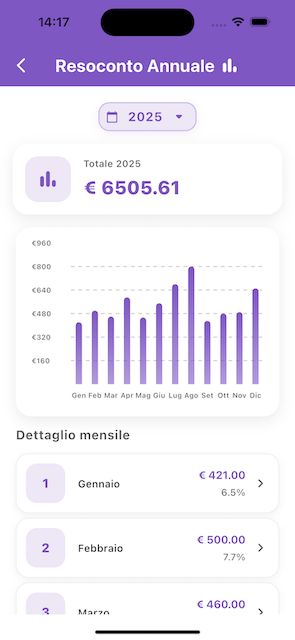

# Expense Tracker


**Expense Tracker** è un'app mobile Flutter per la gestione delle spese personali.  
Permette di creare e tenere traccia delle spese, con statistiche giornaliere, mensili e annuali, supporto a notifiche e dark mode.

---

## 🎯 Obiettivi del progetto
- Monitorare le spese personali in modo semplice e veloce.
- Visualizzare resoconti giornalieri, mensili e annuali.
- Inviare notifiche giornaliere e avvisi di superamento limite spesa.
- Offrire un'esperienza responsive e adaptive su dispositivi mobili.
- Supportare autenticazione sicura tramite Firebase.

---

## 📱 Funzionalità principali
- **Autenticazione Firebase** (login / registrazione)
- **Gestione spese**: aggiunta, modifica e cancellazione delle spese
- **Resoconti**:
  - DaysPage → riepilogo giornaliero
  - MonthsPage → riepilogo mensile
  - YearsPage → riepilogo annuale con grafico 
- **Pagine principali**:
  - AuthPage → login e registrazione
  - HomePage → overview delle spese recenti
  - ProfilePage → informazioni utente
  - SettingsPage → impostazioni app, notifiche, limiti di spesa
- **Notifiche locali**:
  - Giornaliera
  - Superamento limite spesa
- **Dark Mode** e layout adattivo con supporto a Cupertino/Material
- **Responsive Layout** con `flutter_screenutil`

---

## ⚡ Screenshot
**Login Page**  


**Home Page**  


**Years Page**  


---

## 🗂️ Struttura del progetto
- `lib/main.dart` → Entry point: inizializza Firebase, localizzazione e registra i servizi tramite GetIt
- `lib/app.dart` → Configurazione app: tema, localizzazione, routing e gestione lifecycle
- `lib/components/` →  Widget riutilizzabili e componenti UI custom
- `lib/models/` → Data classes e modelli di dominio (ExpenseModel)
- `lib/pages/` → Schermate dell'applicazione
- `lib/providers/` → Provider per la gestione dello stato globale (settings, tema, spese, selezione multipla)
- `lib/repositories/` → Pattern Repository per l'accesso ai dati (Firestore)
- `lib/services/` → Servizi che incapsulano logica condivisa dell'app (autenticazione, profilo, notifiche)
- `lib/theme/` → Palette colori
- `lib/utils/` → Utility, helper e mixin riutilizzabili (dialog, snackbar, animazioni)
- `lib/firebase_options.dart` → Configurazione Firebase autogenerata

---

## 🧱 Stack Tecnologico
- **Framework:** Flutter & Dart  
- **State Management:** Provider (gestione stato reattivo e globale)
- **Service Locator:** GetIt (per l'iniezione delle dipendenze e singleton)
- **Database:** Firebase Firestore  
- **Autenticazione:** Firebase Auth  
- **Notifiche:** `flutter_local_notifications`  
- **Gestione layout responsive:** `flutter_screenutil`  
- **Grafici:** `fl_chart`  
- **Localizzazione:** `intl`  

---

## 🚀 Setup e installazione
Clona il repository:
```bash
git clone https://github.com/vittorspa-hash/expense_tracker.git
cd expense_tracker
```
Installa le dipendenze Flutter:
```bash
flutter pub get
```
Configura Firebase:
- Scarica i file:
- `GoogleService-Info.plist` → iOS
- `google-services.json` → Android
- Posizionali nelle rispettive cartelle:
- `ios/Runner/`
- `android/app/`

Avvia l'app:
```bash
flutter run
```

---

## 📝 Note importanti
- `firebase_options.dart` è incluso e contiene solo **chiavi pubbliche** Firebase; non rappresenta un rischio di sicurezza.
- I file sensibili `GoogleService-Info.plist` e `google-services.json` **non sono tracciati su GitHub**.

---

## 📄 Licenza
MIT License © Vittorio Spagnuolo