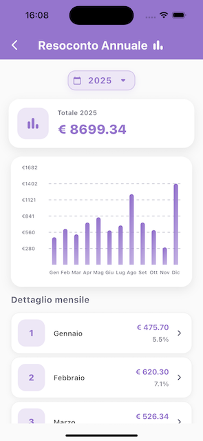

# Expense Tracker


**Expense Tracker** è un'app mobile Flutter per la gestione delle spese personali.  
Permette di creare e tenere traccia delle spese, con statistiche giornaliere, mensili e annuali, 
supporto a notifiche, dark mode, localizzazione completa (IT, EN, FR, ES, DE, PT) e un sistema multi-valuta intelligente con tassi di cambio storici.

---

## 🎯 Obiettivi del progetto
- Monitorare le spese personali in modo semplice e veloce.
- Sincronizzare i dati su cloud (Firestore) per garantirne l'accesso da qualsiasi dispositivo.
- Visualizzare resoconti giornalieri, mensili e annuali.
- Inviare notifiche giornaliere e avvisi di superamento limite spesa.
- Offrire un'esperienza responsive e adaptive su dispositivi mobili.
- Supportare autenticazione sicura tramite Firebase Auth.
- Garantire accessibilità internazionale tramite supporto multilingua e multivaluta.

---

## 📱 Funzionalità principali
- **Autenticazione Firebase Auth** (Login / Registrazione)
- **Gestione spese & Cloud Sync**: 
  - Aggiunta, modifica e cancellazione delle spese
  - Salvataggio automatico su Firestore per accesso multi-device.
- **Supporto Multilingua**:
  - Rilevamento automatico della lingua del dispositivo
  - Traduzione completa in:
    - 🇮🇹 Italiano (`it`)
    - 🇺🇸 Inglese (`en`)
    - 🇫🇷 Francese (`fr`)
    - 🇪🇸 Spagnolo (`es`)
    - 🇩🇪 Tedesco (`de`)
    - 🇵🇹 Portoghese (`pt`)
- **Multi-Valuta Smart**: 
  - Supporto per valute:
    - EUR (€),
    - USD ($),
    - GBP (£),
    - JPY (¥).
  - Conversione in tempo reale basata su API (Frankfurter).
- **Resoconti**:
  - DaysPage → Riepilogo giornaliero
  - MonthsPage → Riepilogo mensile
  - YearsPage → Riepilogo annuale con grafico 
- **Pagine principali**:
  - AuthPage → Login e registrazione
  - HomePage → Overview delle spese recenti
  - ProfilePage → Informazioni utente
  - SettingsPage → Impostazioni app (Tema, Notifiche, Lingua, Valuta)
- **Notifiche locali**:
  - Giornaliera
  - Superamento limite spesa
- **Dark Mode** e **Adaptive Layout** con supporto a Cupertino/Material
- **Responsive Layout** con `flutter_screenutil`

---

## 🌟 Feature Spotlight: Cloud Sync & Smart Multi-Currency
L'architettura unisce la potenza di Cloud Firestore per la sincronizzazione real-time tra dispositivi con una logica custom per la coerenza finanziaria:

1. **Cloud-First & Multi-Device**: Ogni spesa viene salvata direttamente su Firestore. Questo garantisce che i dati siano 
accessibili e sincronizzati istantaneamente su qualsiasi dispositivo su cui l'utente effettui il login.
2. **Snapshot dei Tassi Storici**: Al momento della creazione di una spesa, vengono scaricati e "congelati" i tassi di cambio attuali. 
Una spesa di 100$ fatta 6 mesi fa manterrà il suo controvalore storico in €, preservando la veridicità dei report finanziari.
3. **Hybrid Offline Resilience**:
 - *Dati Spesa*: Grazie alla persistenza locale di Firestore, l'utente può aggiungere spese anche senza internet; il database si sincronizzerà automaticamente al ritorno della connessione.
 - *Tassi di Cambio (Soft Fail)*: Se l'API dei cambi non è raggiungibile, il sistema tenta il recupero dalla cache locale. Se vuota, salva la spesa con un flag di warning e un tasso fallback, senza bloccare l'utente.
4. **Self-Healing (Smart Update)**: Il sistema implementa una logica di auto-riparazione. Quando la connessione torna disponibile 
e l'utente interagisce con una spesa "incompleta", l'app scarica silenziosamente i tassi storici mancanti, aggiorna il record su Firestore e rimuove il warning.

---

## ⚡ Screenshot
**Auth Page**  


**Home Page**  


**Years Page**  


---

## 🗂️ Struttura del progetto
- `lib/main.dart` → Entry Point: Configurazione ambiente, inizializzazione Firebase, Dependency Injection (GetIt) e iniezione dei MultiProvider
- `lib/app.dart` → App Configuration: Tema, localizzazione, routing e gestione lifecycle
- `lib/components/` →  Widget UI riutilizzabili divisi per contesto
- `lib/config/` → File di configurazione centralizzati
- `lib/l10n/` →  File .arb con stringhe tradotte in 6 lingue
- `lib/models/` → Data classes e modelli di dominio
- `lib/pages/` → Schermate dell'applicazione
- `lib/providers/` → State Layer: Collegano la UI alla logica di business
- `lib/repositories/` → Data Layer: Accesso diretto ai dati (Firestore)
- `lib/services/` → Business Logic: Logica pura condivisa iniettata tramite GetIt
- `lib/theme/` → Definizione palette colori
- `lib/utils/` → Utilities: Motore di calcolo, sistema dialoghi adattivi, gestione snackbar e animazioni
- `lib/firebase_options.dart` → Configurazione Firebase autogenerata

---

## 🧱 Stack Tecnologico
- **Framework:** Flutter & Dart  
- **Architecture:** Layered Architecture (UI ↔ Provider ↔ Service ↔ Repository)
- **State Management:** Provider
- **Dependency Injection:** GetIt 
- **Database:** Firebase Firestore  
- **Autenticazione:** Firebase Auth  
- **UI/UX Pattern:** Adaptive Design (Material per Android, Cupertino per iOS)
- **Responsive Layout:** `flutter_screenutil`  
- **Networking:** `http` (API Frankfurter per tassi di cambio)
- **Notifications:** `flutter_local_notifications`  
- **Charts:** `fl_chart`  
- **Internationalization:** `flutter_localizations`, `intl`
- **Utilities:** `uuid` (ID univoci), `shared_preferences` (Cache locale)

---

## 🚀 Setup e installazione
Clona il repository:
```bash
git clone https://github.com/vittorspa-hash/expense_tracker.git
cd expense_tracker
```
Installa le dipendenze Flutter:
```bash
flutter pub get
```
Configura Firebase:
- Scarica i file:
- `GoogleService-Info.plist` → iOS
- `google-services.json` → Android
- Posizionali nelle rispettive cartelle:
- `ios/Runner/`
- `android/app/`

Avvia l'app:
```bash
flutter run
```

---

## 📝 Note importanti
- `firebase_options.dart` è incluso e contiene solo **chiavi pubbliche** Firebase; non rappresenta un rischio di sicurezza.
- I file sensibili `GoogleService-Info.plist` e `google-services.json` **non sono tracciati su GitHub**.

---

## 📄 Licenza
MIT License © Vittorio Spagnuolo