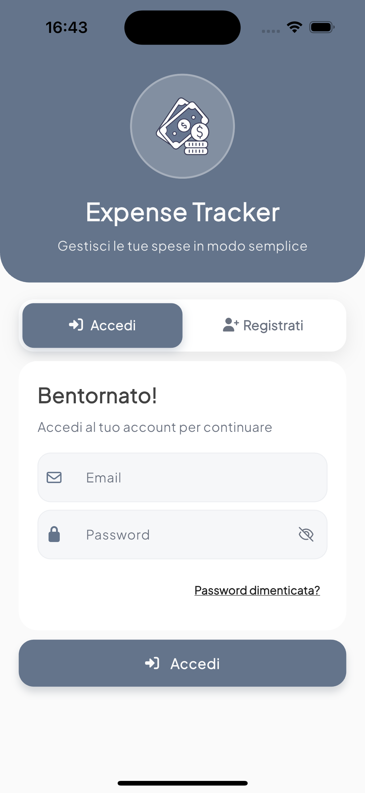
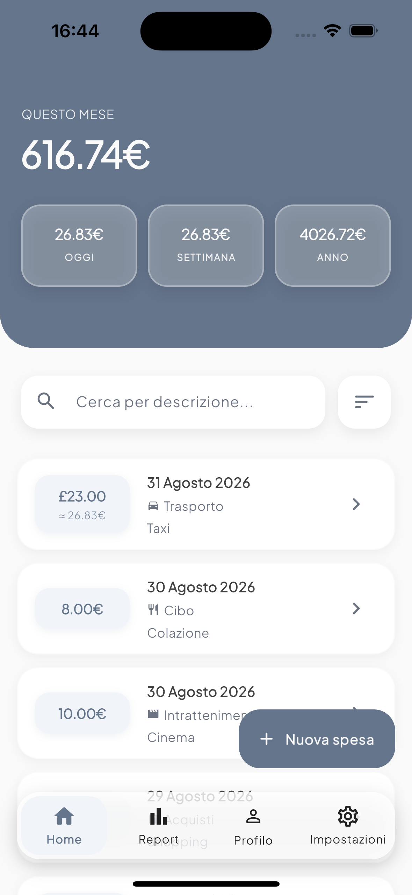
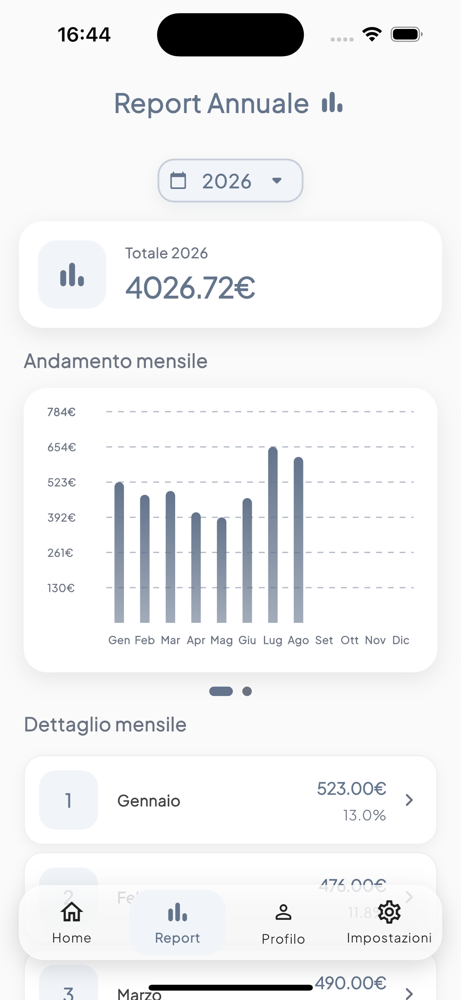

# Expense Tracker


**Expense Tracker** è un'app mobile Flutter per la gestione delle spese personali.  
Permette di creare e tenere traccia delle spese, con statistiche giornaliere, mensili e annuali, 
supporto a notifiche, dark mode, localizzazione completa (IT, EN, FR, ES, DE, PT) e un sistema multi-valuta intelligente con tassi di cambio storici.

---

## 🎯 Obiettivi del progetto
- Monitorare le spese personali in modo semplice e veloce.
- Supportare autenticazione sicura tramite Firebase Auth.
- Sincronizzare i dati su cloud (Firestore) per garantirne l'accesso da qualsiasi dispositivo.
- Visualizzare resoconti giornalieri, mensili e annuali.
- Inviare notifiche giornaliere e avvisi di superamento limite spesa.
- Garantire accessibilità internazionale tramite supporto multilingua e multivaluta.
- Offrire un'esperienza responsive e adaptive su dispositivi mobili.

---

## 📱 Funzionalità principali
- **Autenticazione Firebase Auth** (Login / Registrazione)
- **Gestione spese & Cloud Sync**: 
  - Aggiunta, modifica e cancellazione delle spese
  - Salvataggio automatico su Firestore per accesso multi-device.
- **Supporto Multilingua**:
  - Rilevamento automatico della lingua del dispositivo
  - Traduzione completa in:
    - 🇮🇹 Italiano (`it`)
    - 🇺🇸 Inglese (`en`)
    - 🇫🇷 Francese (`fr`)
    - 🇪🇸 Spagnolo (`es`)
    - 🇩🇪 Tedesco (`de`)
    - 🇵🇹 Portoghese (`pt`)
- **Multi-Valuta Smart**: 
  - Supporto per valute:
    - EUR (€),
    - USD ($),
    - GBP (£),
    - JPY (¥).
  - Conversione in tempo reale basata su API (Frankfurter).
- **Categorie spese**:
  - Classificazione delle spese per categoria
  - Visualizzazione della distribuzione tramite grafico a torta nella YearsPage
- **Resoconti**:
  - DaysPage → Riepilogo giornaliero
  - MonthsPage → Riepilogo mensile
  - YearsPage → Riepilogo annuale con grafico a barre e grafico a torta per categoria
- **Pagine principali**:
  - AuthPage → Login e registrazione
  - NavigationShell → Shell post-login con floating bottom navigation bar (Home, Report, Profile, Settings)
  - HomePage → Overview delle spese recenti
  - YearsPage → Riepilogo annuale con grafici
  - ProfilePage → Informazioni utente
  - SettingsPage → Impostazioni app (Tema, Notifiche, Lingua, Valuta)
- **Notifiche locali**:
  - Giornaliera
  - Superamento limite spesa
- **Dark Mode** e **Adaptive Layout** con supporto a Cupertino/Material
- **Responsive Layout** con `flutter_screenutil`

---

## 🌟 Feature Spotlight: Cloud Sync & Smart Multi-Currency
L'architettura unisce la potenza di Cloud Firestore per la sincronizzazione real-time tra dispositivi con una logica custom per la coerenza finanziaria:

1. **Cloud-First & Multi-Device**: Ogni spesa viene salvata direttamente su Firestore. Questo garantisce che i dati siano 
accessibili e sincronizzati istantaneamente su qualsiasi dispositivo su cui l'utente effettui il login.
2. **Snapshot dei Tassi Storici**: Al momento della creazione di una spesa, vengono scaricati e "congelati" i tassi di cambio attuali. 
Una spesa di 100$ fatta 6 mesi fa manterrà il suo controvalore storico in €, preservando la veridicità dei report finanziari.
3. **Hybrid Offline Resilience**:
 - *Dati Spesa*: Grazie alla persistenza locale di Firestore, l'utente può aggiungere spese anche senza internet; il database si sincronizzerà automaticamente al ritorno della connessione.
 - *Tassi di Cambio (Soft Fail)*: Se l'API dei cambi non è raggiungibile, il sistema tenta il recupero dalla cache locale. Se vuota, salva la spesa con un flag di warning e un tasso fallback, senza bloccare l'utente.
4. **Self-Healing (Smart Update)**: Il sistema implementa una logica di auto-riparazione. Quando la connessione torna disponibile 
e l'utente interagisce con una spesa "incompleta", l'app scarica silenziosamente i tassi storici mancanti, aggiorna il record su Firestore e rimuove il warning.

---

## ⚡ Screenshot
| Auth Page | Home Page | Years Page |
|:---:|:---:|:---:|
|  |  |  |

---

## 🗂️ Struttura del progetto
- `lib/main.dart` → Entry Point: Configurazione ambiente, inizializzazione Firebase e avvio dell'applicazione all'interno di un ProviderScope
- `lib/app.dart` → App Configuration: Tema, localizzazione, routing e gestione lifecycle
- `lib/components/` →  UI Components: Widget UI riutilizzabili divisi per contesto
- `lib/config/` → Configuration: File di configurazione centralizzati (di, tema, lingue, routing)
  - `lib/config/di` → **Dependency Injection Layer**: definizione, configurazione ed esportazione dei provider di Riverpod
- `lib/l10n/` → Localization: File .arb con stringhe tradotte in 6 lingue
- `lib/models/` → Domain Models: Data classes e modelli di dominio
- `lib/pages/` → Screens: Schermate dell'applicazione
- `lib/notifiers/` → **State Management Layer**: Gestiscono lo stato UI e orchestrano chiamate ai service. 
- `lib/repositories/` → **Data Access Layer**: Accesso diretto ai dati (Firestore CRUD operations)
- `lib/services/` → **Business Logic Layer**: Servizi core delegati alla logica applicativa pura, orchestrati dai Notifier
- `lib/utils/` → Utilities: Motore di calcolo, sistema dialoghi adattivi, gestione snackbar e animazioni

---

## 🧱 Stack Tecnologico
- **Framework:** Flutter & Dart  
- **Architecture:** Layered Architecture (UI ↔ Riverpod Notifier ↔ Service ↔ Repository)
- **State Management & DI:** Riverpod
- **Database:** Firebase Firestore  
- **Autenticazione:** Firebase Auth  
- **UI/UX Pattern:** Adaptive Design (Material per Android, Cupertino per iOS)
- **Responsive Layout:** `flutter_screenutil`  
- **Networking:** `http` (API Frankfurter per tassi di cambio)
- **Notifications:** `flutter_local_notifications`  
- **Charts:** `fl_chart`  
- **Internationalization:** `flutter_localizations`, `intl`
- **Utilities:** `uuid` (ID univoci), `shared_preferences` (Cache locale)

---

## 🧪 Testing

Il progetto include una test suite  di **78 unit test** con **~99.1% di coverage** sui componenti core.

### 📊 Coverage Breakdown

| Componente | Test | Coverage | Descrizione |
|------------|------|----------|-------------|
| **ExpenseModel** | 13 | 100% | Serializzazione, conversione multi-valuta, copyWith, edge cases |
| **ExpenseCalculator** | 25 | 100% | Calcoli temporali, aggregazioni per grafici, ordinamento |
| **ExpenseService** | 26 | 100% | CRUD operations, soft-fail strategy, smart-update logic, budget checks |
| **CurrencyService** | 14 | 94.1% | Persistenza, HTTP mocking, network-cache strategy, multi-valuta |


### 🛠️ Tecnologie di Testing
- **flutter_test**: Framework di testing Flutter
- **mockito**: Mock di dipendenze (Firebase, HTTP, SharedPreferences)
- **build_runner**: Generazione automatica dei mock

---

## 🚀 Setup e installazione
Clona il repository:
```bash
git clone https://github.com/vittorspa-hash/expense_tracker.git
cd expense_tracker
```
Installa le dipendenze Flutter:
```bash
flutter pub get
```
Configura Firebase:
 - Scarica i file:
  - `GoogleService-Info.plist` → iOS
  - `google-services.json` → Android
 - Posizionali nelle rispettive cartelle:
  - `ios/Runner/`
  - `android/app/`

Avvia l'app:
```bash
flutter run
```

---

## 📝 Note importanti
- `firebase_options.dart` è incluso e contiene solo **chiavi pubbliche** Firebase; non rappresenta un rischio di sicurezza.
- I file sensibili `GoogleService-Info.plist` e `google-services.json` **non sono tracciati su GitHub**.

---

## 📄 Licenza
MIT License © Vittorio Spagnuolo